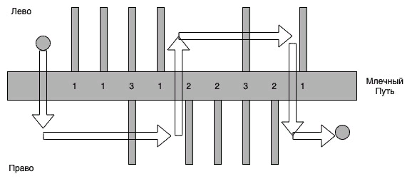

# Доставка от Валли
Робот-курьер Валли получил задание доставить посылку из пункта А в пункт Б. Весь маршрут Валли пролегает вдоль оживленной дороги с множеством перекрестков под названием Млечный Путь. Пункт А находится слева от Млечного Пути, а пункт Б — справа. Валли очень не нравится переходить дорогу по пешеходному переходу. Хорошо, что у него есть карта и он успел ее изучить. Помогите Валли определить минимальное количество пешеходных переходов, которыми ему придется воспользоваться.
### Формат ввода
Единственная строка содержит описание Млечного Пути между точками А и Б. Длина строки не превосходит $10^5$ символов. Каждый символ строки может быть одной из трех цифр — 1, 2 или 3:

- цифра 1 означает, что есть дорога, впадающая в Млечный Путь слева;
- цифра 2 — есть дорога, впадающая в Млечный Путь справа;
- цифра 3 — есть дороги, впадающие в Млечный Путь слева и справа в одном месте.

### Формат вывода
Выведите одно число - минимальное количество пешеходных переходов, которыми придется воспользоваться Валли.

### Пример
|**Ввод**                        | **Вывод**   |
|----------------------------|---------|
| 113122321                  | 5       |

### Примечания
Точка А расположена перед описанной частью Млечного Пути. Точка Б расположена после описанной части.
